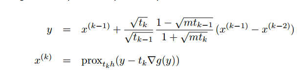
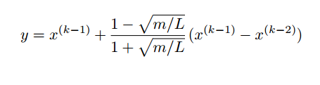
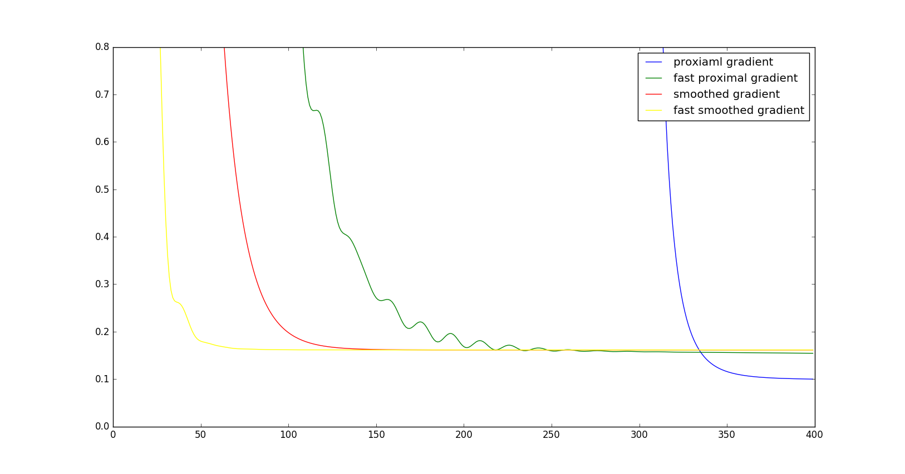

#                                    homework5第二次作业

## 1.proximal gradient method

- unconstrained optimization with objective splite in two components
  $$
  minimize  \ \ f(x) = g(x) + h(x)
  $$

  - g convex, differentiable,dom g = $R^n$

  - h convex with inexpensive pro-operator

  - proximal gradient algorithm

  - $$
    x^{(k)} = prox_{t_{k}h}(x^{(k-1)}-t_k \nabla g(x^{(k-1)}))
    $$

    - $t_k > 0$ is step size,constant or determined by line search

- 具体到本问题：

  - $$min \ \ \frac{1}{2}||Ax-b||_2^2 + \mu ||x||_1$$
  - $x=x_0$
  - .PNG)
  - $t_k = 1/L$  , $L = \lambda _{max}(A^{T}A)$
  - 终止条件：$x^{*} = prox_{th}(x^*)$
  - 收敛速度：$O(\frac{1}{k})$
  - 
  - ​
  - 加速方法参考

## 2.accelerate proximal gradient method

- 
- 版本很多，这里实现的是上面比较简单的方法。
- $t_{k} = 1/L$
- $L = \lambda_{max}(A^TA)$
- $m = \lambda_{min}(A^TA)$
- 
- 收敛速度

## 3.gradient decent with smoothing method 

- 
- 
- 这里$L_{\mu} = L + 1/\mu$  
- $L = \lambda_{max}(A^TA)$
- efficiency in practice can be improved by decreasing µ gradually
- 复杂性：见下面的表格

## 4. fast gradient decent with smoothing method

- $y = x^{(k-1)}+\frac{k-2}{k+1}(x^{(k-1)}-x^{(k-2)})$
- $x^{k} = y - t_{k}\nabla g(y)$

## 5.收敛速度理论对比

| first-order convex optimization methods | iterations             |
| --------------------------------------- | ---------------------- |
| subgradient method                      | $O((G/\epsilon)^2)$    |
| proximal gradient method                | $O(L/\epsilon)$        |
| fast proximal gradient method           | $O(\sqrt{L/\epsilon})$ |
| gradient method with smoothing          | $O(L/\epsilon^2)$      |
| fast gradient method with smoothing     | $O(\sqrt{L}/\epsilon)$ |

- 其中L 为f的  Lipschitz constant
- $\epsilon$-suboptimal point of $f(x)$

## 6.实际实验的收敛性

### 7这里有三种常用的函数：

- projection
- sugradient
- shrinkage
- 对应运算为：proximal,sugradient,conjucate

