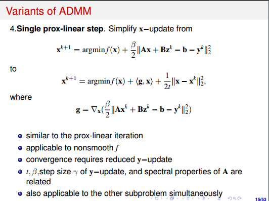

# homework5第三次作业

### ADMM_primal

primal problem：
$$
min \ \frac{1}{2} ||Ax-b||_{2}^2 +\mu||z||_1
\\ subject\  to : x-z =0
$$
iteration :
$$
z^{k+1} = argmin_{z} \ \ \mu ||z||_1 + <y^k,-z> + \frac{c}{2}||x^k -z||_2^2
\\ z^{k+1}  = shrinkage(x^k+\frac{y^k}{c},\frac{\mu}{c})
\\ x^{k+1} = argmin_x \ \ \frac{1}{2}||Ax-b||^2 +<y^k,x>+\frac{c}{2}||x-z^{k+1}||_2^2
\\ x^{k+1} = (A^TA+cI)^{-1}(A^Tb-y^k+cz^k)
\\ y^{k+1} = y^k + c(x^{k+1} -z^{k+1})
$$
终止条件：
$$
abs(f(x^k) - f(x^{k+1})) <\epsilon
$$

### admm with linear primal problem

有两种线性化的方式：

- ​

- ​

$$
z^{k+1} = argmin_{z} \mu ||z||_1 + <g^k,z-z^k> + \frac{1}{2\tau}||z-z^k||_2^2
\\ g^k = -y^k-c(x^k-z^k)
\\ z^{k+1} = shrinkage(z^k-\tau g^k,\tau \mu)
$$

- ​
  $$
  x^{k+1} = argmin_{x} \ \frac{1}{2}||Ax-b||_2^2 + <g^k,x-x^k>+\frac{1}{2\tau}||x-x^k||_2^2
  \\ g^k = y^k+c(x-z^{k+1})
  \\ x^{k+1} = (\tau A^TA+I)^{-1}(x^k-\tau g^k+\tau A^Tb)
  $$
  ​

### ADMM_dual 

第一次推导如下面的图片，但是用代码实现时，是不收敛的，照片里有一个非常隐蔽的错误。

正确推导过程如下：
$$
min \frac{1}{2} ||Ax-b||_2^2 + \mu ||x||_1
\\<=>
\\min \frac{1}{2}||z||_2^2 + \mu ||x||_1
\\ subject \ to\  Ax-b = z
\\=>
\\lagrange \  function : L(x,z;y) = \frac{1}{2}||z||_2^2 + \mu ||x||_1+y^T(Ax-b-z)
\\=>
\\** lagrange\  dual\  function** : g(y) = -\frac{1}{2}||y||_2^2-y^Tb  \\
subject \ to\ ||-A^Ty||_{\infty} \preccurlyeq \mu
$$
**这里一定要注意是$-A^Ty$ 不是$A^Ty$**,虽然两者在约束的意义上是等价的。
$$
dual  \ problem : \ min \ \frac{1}{2}||y||_2^2 + y^Tb + l_{||z||_{\infty} \leq \mu}(z)
\\ subject \ to : -A^Ty + z = 0 
$$
对对偶问题用ADMM：
$$
z^{k+1} = argmin_{z} \ l_{||z||_{\infty}\leq \mu}(z) + <x^k,z> + \frac{c}{2}||-A^Ty^k + z||_2^2
\\ z^{k+1} = - \frac{x^k}{c} + A^Ty^k
\\ y^{k+1} = (I + cAA^T)^{-1}(-b + A(x^k + cz^{k+1}))
\\ x^{k+1} = x^k +c(-A^Ty^{k +1}+ z^{k+1})
$$
结果收敛。

### augumented_dual_lagrange 

这里采用的方法是$z^{k+1}$,$y^{k+1}$多迭代几次，近似找到同时极小化的解。

仅需要在对偶问题的ADMM代码上修改一下就可以实现。

### 实验结果

在相邻两步下降小于tol或迭代次数超过maxiteration的时候终止

