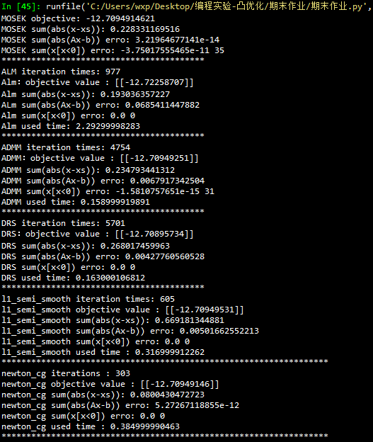

# 凸优化project2报告

### 1（a）

---

dual: 
$$
        \max_{y\epsilon\mathbb{R^m},s\epsilon\mathbb{R^n}}b^Ty \\
        s.t: A^Ty+s=c \\
        s \geqslant 0
$$
equal problem :
$$
\min_{y\epsilon\mathbb{R^m},s\epsilon\mathbb{R^n}}-b^Ty + l_{s \geqslant 0}(s) \\
    s.t: A^Ty+s=c
$$
Augumented Lagrange Equation :
$$
\begin{split}
    L_{\rho}(y,s;x) &= -b^Ty + l_{s\geqslant0}(s) + x^T(A^Ty+s-c) + \frac{\rho}{2}||A^Ty+s-c||_2^2 \\
              &= -b^Ty + l_{s\geqslant0}(s) + \frac{\rho}{2}[||A^Ty+s-c||_2^2 + \frac{2}{\rho} x^T(A^Ty+s-c) + \frac{1}{\rho^2}||x||_2^2 -  \frac{1}{\rho^2}||x||_2^2] \\
              &=-b^Ty + l_{s\geqslant0}(s) + \frac{1}{2\rho}(||\rho(A^Ty+s-c)+x||_2^2-||x||_2^2)
\end{split}
$$
Augumented Lagrange Equation :
$$
\begin{split}
    L_{\rho}(y;x) &= \inf_{s} L_{\rho}(y,s;x) \\
              &= L_{\rho}(y,s_0;x)  \ where \ \frac{\partial L_{\rho}(y,s;x)}{\partial s} = 0 \ and \  s_0 = \Pi_{s \geqslant 0}(-\frac{x}{\rho}+c-A^Ty) \\
              &= -b^Ty  + \frac{1}{2\rho}(||\rho(A^Ty-c)+x + \Pi_{s \geqslant 0}-(x+\rho(A^Ty-c))||_2^2-||x||_2^2) \\
              &= -b^Ty  + \frac{1}{2\rho}( ||\Pi_{s \geqslant 0}(x+\rho(A^Ty-c))||_2^2-||x||_2^2)
\end{split}
$$
ALM: 
$$
y^{k+1} = argmin_{y}L_{\rho}(y,x^k) ——这个子问题可以用homework5里的方法求\\
x^{k+1} = \Pi_{s \geqslant 0}(x^k+\rho(A^Ty^{k+1}-c)
$$
### 1(b)
---
>  $ \frac{\partial L_{\rho}(y,x^k)}{\partial y} = -b + A(\Pi_{s \geqslant 0 }(x^k + \rho(A^Ty-c)))  $
>
>  这里用梯度下降的方法求解子问题。收敛速度比较慢，原因可以用论文里的解释。就是说ALM就是dual问题的梯度下降，求解子问题也用梯度下降的话，理论上是更慢的。
>
>  - It has long been known that the augmented Lagrangian method for convex problems is a gradient ascent method applied to the corresponding dual problems 
>  - This inevitably leads to the impression that the augmented Lagrangian method for solving SDP problems may converge slowly for the outer iteration sequence$X_k$ 
>
>  具体算法可见程序源码。

### 1(c)

- 这里计算$M(y) \in\frac{\partial^2L_{\rho}(y,x^k)}{y}$ ,$M(z) = \rho APA^T$,其中$P$是对角阵，$P_{ii} = 1$若$(x^k + \rho(A^Ty-c))_i>=0$,

  $P_{ii} = 0$若$(x^k + \rho(A^Ty-c))_{i}<0$

- 按照论文里的算法2和算法3实现，具体算法见程序源码。

### 2（a）

---

#### ADMM: 
dual problem 
$$
min -b^Ty + l_{s \geqslant 0}(s)\\
s.t  \ \ A^Ty+s=c \\
$$
ADMM algorithom:
$$
    y^{k+1} = argmin_{y}-b^Ty + <x^k,A^Ty>+\frac{\rho}{2}||A^Ty+s^k-c||_2^2
    \\ y^{k+1} = (\rho AA^T)^{-1}(b-Ax^k-\rho A(s^k-c))
    \\ s^{k+1} = argmin_{s} l_{s\geqslant 0 }(s) + <x^k,s> +\frac{\rho}{2}||A^Ty^{k+1}+s-c||_2^2
    \\ s^{k+1} = \Pi_{s\geqslant 0}(-\frac{x^k}{\rho}+c-A^Ty^{k+1})
    \\ x^{k+1} =  x^k + \rho (A^Ty^{k+1}+s^{k+1}-c)
$$
#### DRS:
primal problem
$$
    min  \ \ c^Tx \\
    s.t \ \ Ax = b \\
    x \geqslant 0
$$
转换一下形式
$$
    min \ \ g(x) + f(x)
    \\g(x) = c^Tx + l_{Ax=b}(x)  \\ f(x) = l_{x \geqslant 0}(x)
$$
DRS algorithom :
$$
u^+ = prox_{\rho g }(x+w) \\
u^+ = (-c \rho + x + w)  + A^T(AA^T)^{-1}(b-A(-c\rho +x + w)) \\
 x^+ = prox_{\rho f}(u^+ - w) \\
 x^+ = \Pi_{s \geqslant 0}(u^+ - w) \\
 w^+ = w + x^+ - u^+
$$
###2(b)---------对某个问题用ADMM等价于对它的对偶问题用DRS----------------
---

这里ADMM中出现的变量有$y^{k+1},s^{k+1},x^{k+1}$,DRS中出现的变量有$u^+,x^+,w^+$.

它们之间的关系是：
$$
\\
    u^+ = x^k + \rho s^{k} + \rho (A^Ty^{k+1}-c) \\
    x^+ = x^{k+1} \\
    w^+ = \rho s^{k+1}
$$
**可以结合2（a）验证关系成立。下面给出一般性的证明。**

---

ADMM：
$$
min \ \ f_1(x_1) + f_2(x_2) \\
s.t:A_1x_1 + A_2x_2 = b
$$
algorithom:
$$
    x_1^{k+1} = argmin_{x_1}f_1(x_1) + <A_1x_1,z^k> + \frac{\rho}{2}||A_1x_1 + A_2x_2^k-b||_2^2 \\
    x_2^{k+1} = argmin_{x_2}f_2(x_2) + <A_2x_2,z^k> + \frac{\rho}{2}||A_1x_1^k + A_2x_2 - b||_2^2 \\
    z^{k+1} = z^k + \rho(A_1x_1^{k+1} + A_2x_2^{k+1})
$$
DRS:
$$
    min \ \ b^Tz + f_1^*(-A_1^Tz) + f_2^*(-A_2^Tz) \\
    g(z) := b^Tz + f_1^*(-A_1^Tz)  \\
    f(z) := f_2^*(-A_2^Tz) 
$$
algorithom:
$$
u^+ = prox_{\rho g }(z+w) \\
    z^+ = prox_{\rho f}(u^+ - w)  \\
    w^+ = w + z^+ - u^+
$$
##### 对对偶问题用proximal method 等价于对原问题用ALM。从而ADMM和DRS的关系得证。
下面具体证明

---

- proximal method:
$$
u^+ = prox_{\rho g}(z+w) \\  
    u^+ = argmin_x b^Tx + f_1^*(-A_1^Tx) + \frac{1}{2 \rho}||x-(z+w)||_2^2   \ \ ----(1)\\
$$
- ALM:
$$
u^+ = z+w+\rho(A_1\hat x_1-b)   \ \ \ \ \ \  \ \ \ \ \ ----(2) \\
    \hat x_1 = argmin_{x_1}f_1(x_1) + <z+w,A_1x_1> + \frac{\rho}{2}||A_1x_1-b||_2^2\ \  ----(3)
$$
**上面三个等式等价:这里通过验证最优性条件说明**，就是（2）的解满足（1）的最优性条件。
- 对(1)求导有：$b -A_1 \partial f_1^*(-A_1^Tx) + \frac{1}{\rho}(x-(z-w)) = 0 $

- 对(3)求导有：$\partial f_1(x_1) + A_1^T(z+w) + \rho A_1^T(A_1x_1-b) = 0$

- 容易证明这里(2)满足（1）的最优性条件,其中要用到共轭函数之间的梯度的性质

---
- proximal method 
$$
\begin{split} 
    z^+ &= prox_{\rho f}(u^+ - w) \\
      &=prox_{\rho f}(z+\rho(A_1 \hat x_1-b)) \\
      & = argmin_{x}f_2^*(-A_2^Tx) + \frac{1}{2\rho}||z+\rho(A_1 \hat x_1-b)-x||_2^2
\end{split}
$$
- ALM
$$
    z^+ = z + \rho(A_1 \hat x_1 - b) + \rho A_2 \hat x_2  \\
    \hat x_2 = argmin_{x_2}f_2(x_2) + <A_2x_2, z + \rho(A_1 \hat x_1-b)> + \frac{\rho}{2}||A_2x_2||_2^2
$$
类似上面验证最优性条件的证明，可以知道结论成立。

这里也可以通过下式来推，容易理解但比较难推。

~~Moreau decomposition:$z^+ = z + \rho(A_1 \hat x_1 - b) + \rho \ prox_{\rho^{-1}f^*}(\frac{z}{\rho}+A_1\hat x_1 - b)$~~

---
- 从而 $w^+ = A_2 \hat x_2$ 和LP问题对应起来可知前面的关系式成立。

### 2(c) ---------l1_semi_smooth_newton_method---------

---

- 首先这里的$f(x),h(x)$有很多种选择，**老师课件上的$M(x)$写错了**，这里按照论文里的方法选取。这里第一步是写出$F(x)和J(x)$的表达式剩下的就是按照论文里的算法实现。
- $f(x) = l_{Ax=b}(x)$ , $prox_{tf}(x) = (I-A^T(AA^T)^{-1}A)x+A^T(AA^T)^{-1}b$
- $h(x)=c^Tx + l_{x \geq 0}(x)$ , $prox_{th}(x) = \Pi_{s\geq0}(x-ct)$
- $F(x) = prox_{th}(x)-prox_{tf}(2prox_{th}(x)-x)$
- $M(x) \in \partial prox_{th}(x) ,M(x)_{ii}=1当(x-ct)_{i}\geq0,other M(x)_{ii}= 0$
- $(I-A^T(AA^T)^{-1}A)(2M(x)-I) \in \partial prox_{tf}(2prox_{th}(x)-x)$
- $J(x)=M(x)-(I-A^T(AA^T)^{-1}A)(2M(x)-I)$
- ​

### 数值实验的结果：

| method      | objective valu | sum(abs(x <0)) | sum(abs(Ax-b))    | used time      | iterations |
| ----------- | -------------- | -------------- | ----------------- | -------------- | ---------- |
| MOSEK       | -12.709491462  | 0.0 0          | 1.29010069294e-09 | 0.02344417572  | NA         |
| ALM         | -12.72258707   | 0.0 0          | 0.138323246271    | 1.42455196381  | 977        |
| ADMM        | -12.70949251   | -1.6925073e-15 | 0.00679173425056  | 0.187272071838 | 4754       |
| DRS         | -12.70895734   | 0.0 0          | 0.0042776056052   | 0.184229850769 | 5701       |
| semi_smooth | -12.70949531   | 0.0.0          | 0.00501662552313  | 0.30599999     | 605        |
| newton_CG   | -12.70949146   | 0.0.0          | 5.27267118855e-12 | 0.384999990463 | 303        |

### 附件：

